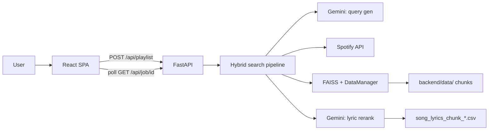
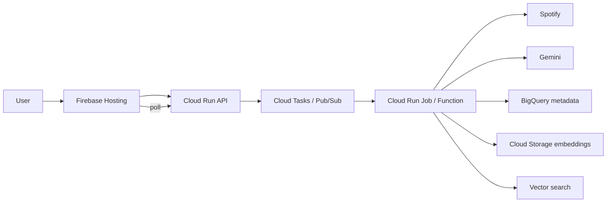

# Cathode Architecture

## Current (local)

Single-machine stack. The React app polls a FastAPI job API; the backend runs the full playlist pipeline in-process.

**Pipeline steps**

1. Gemini generates Spotify playlist search queries from the user's experience + genre filters.
2. Spotify returns candidate tracks; matches are found in the local lyrics metadata corpus.
3. User prompt is embedded (finetuned mpnet or `all-mpnet-base-v2` fallback) and searched via in-memory FAISS.
4. Top vector hits are re-scored by Gemini using full lyrics (0.7 vector + 0.3 LLM, with a views popularity boost).

**Key components**

| Layer | Role |
|-------|------|
| `cathode-frontend/` | 3-step wizard, job polling, in-memory playlist state |
| `backend/api_server.py` | Async jobs, progress, cancellation |
| `backend/api_hybrid_agent.py` | Pipeline orchestration for the API |
| `backend/data_manager.py` | Loads embedding chunks into RAM, FAISS index, song lookup |
| `backend/hybrid_agent.py` | CLI variant (uses `VectorSearcher` instead of DataManager) |
| `backend/llm_filter.py` | On-demand lyrics load + Gemini scoring |

**Data** — Gitignored `backend/data/`: precomputed `embeddings_chunk_*.npy`, `other_columns_chunk_*.pkl`, `song_lyrics_chunk_*.csv`. Missing chunks are skipped with a warning; at least one complete chunk is required.

**Deploy today** — Frontend: Firebase Hosting (`dist/`). Backend: run locally or any host with the dataset + API keys on disk.

---

## Planned (cloud — archived, not implemented)

Abandoned budget GCP design. Code in `archive/cloud_deployment/` was a partial migration (GCS + BigQuery + Vertex AI) and is not maintained.

| Service | Purpose |
|---------|---------|
| Firebase Hosting | Static React app, CDN, SSL |
| Firebase Auth | User login (email/OAuth) — planned, not in current app |
| Cloud Run | Autoscaling API (scale to zero) |
| Cloud Run Jobs / Cloud Functions | Long-running playlist generation off the request path |
| Cloud Tasks / Pub/Sub | Job queue so users don't block on the pipeline |
| Cloud Storage | Embedding arrays, CSV artifacts |
| BigQuery | Lyrics metadata at scale (pay-per-query) |
| Vector search | pgvector in Cloud SQL, Pinecone/Weaviate, or BigQuery vector search |
| Vertex AI | Query embeddings (explored in archived `cathode_api`) |

**Planned flow** — User auth via Firebase → frontend calls Cloud Run API → API enqueues job → worker runs Spotify + vector search + LLM rerank → results stored in BigQuery/SQL → frontend polls for completion.

**Why deferred** — Cost and complexity vs. a portfolio/local demo; partial implementation duplicated the local API without finishing lyrics storage or job infrastructure.

See `archive/README.md` for what was archived and why.
